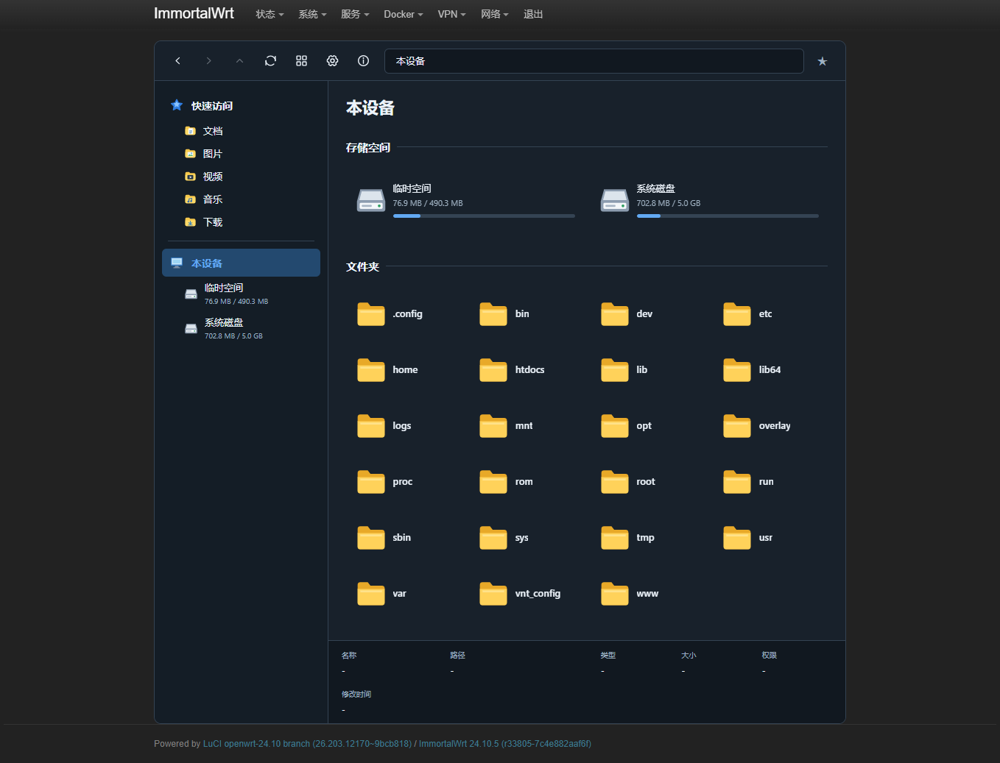
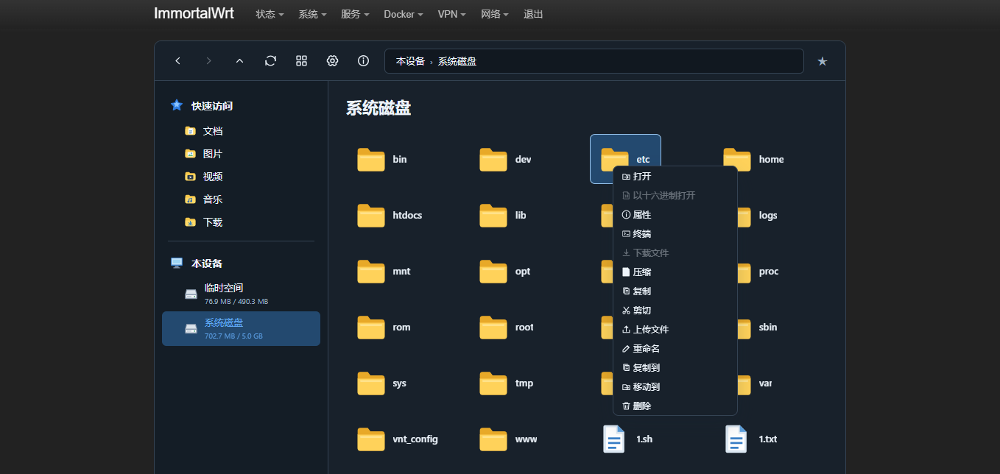
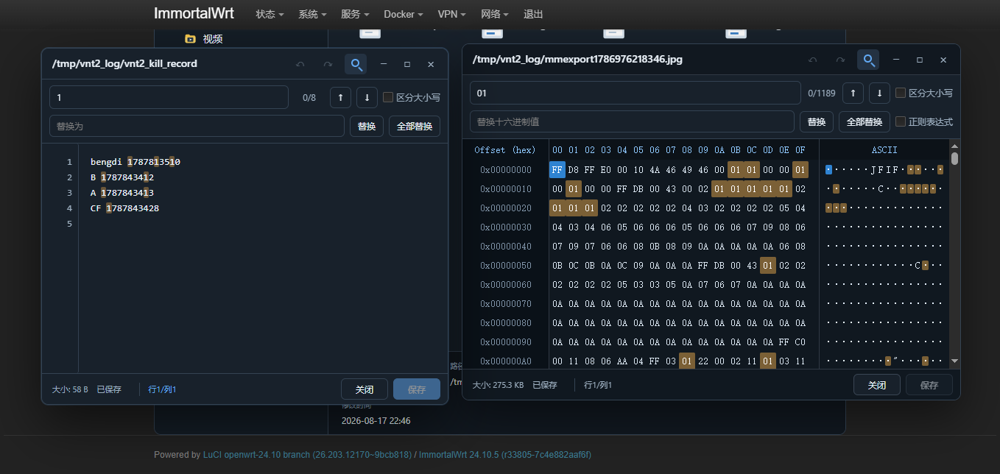
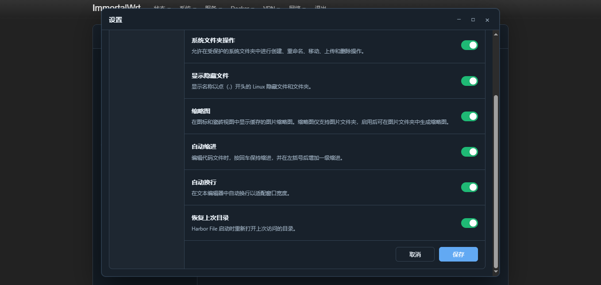
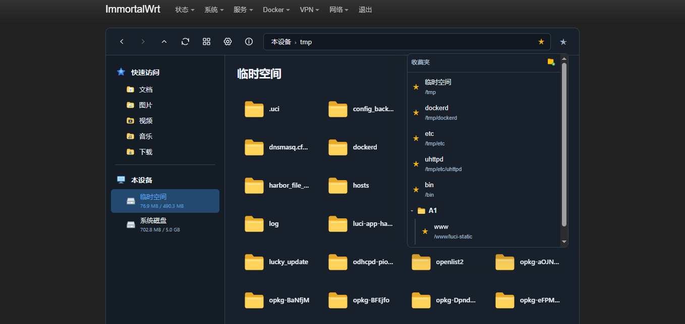
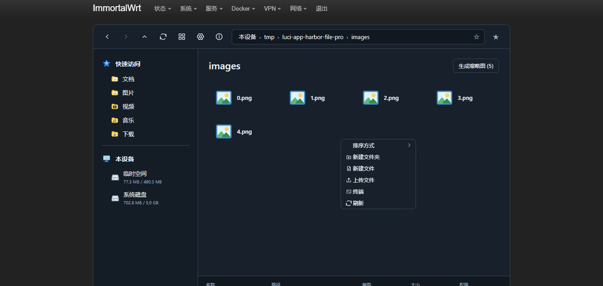

​# Harbor File Pro：让 OpenWrt 文件管理更丝滑

[**English**](./README.md) | English

**Harbor File Pro** 是一款基于 [destan19/luci-app-harbor-file](https://github.com/destan19/luci-app-harbor-file) 深度增强的 OpenWrt 文件管理器。  
在保留原版所有优秀功能的基础上，利用业余时间完成了**代码重构**和**数十项实用新功能**，因多次提交未获上游合并，遂独立为 **Pro 版**。  
**性能更优、操作更顺、功能更强** —— 这就是 Pro 带给你的全新体验。


## 📸 功能截图预览

  
  
  
  
  


---

## 🎯 Pro 版核心亮点（对比原版，全面升级）

### 🪟 现代化窗口交互 —— 像桌面应用一样顺手
- **窗口控制**：支持放大/缩小、最小化，自由调整大小，并自动记忆尺寸。
- **任务栏与拖拽**：标题栏可拖拽移动；新增任务栏，支持多窗口快速切换，闲置 3 秒自动隐藏，鼠标滚动或移动端滑动即可呼出。
- **自适应滚动**：页面自动铺满屏幕，内容超长时支持左右上下滑动查看。

### 📝 文本编辑器 —— 大文件无压力，操作更智能
- **查找与替换**：支持区分大小写，显示结果数量及位置，结果高亮；提供替换、全部替换、上一个/下一个导航。
- **无限撤销/重做**：操作失误轻松回退。
- **异常恢复**：意外关闭或未保存时，自动询问是否恢复，避免数据丢失。
- **行号切换**：一键显示/隐藏行号。
- **自动缩进与换行**：代码编写时自动缩进（普通文本不缩进），查看时支持自动换行。
- **🚀 性能突破**：**无文件大小限制**，打开 1TB 与 1KB 文件同样流畅（取决于设备性能，浏览器不卡顿）。

### 🔢 十六进制编辑器 —— 专业级调试工具
- **查找与替换**：支持正则表达式、区分大小写，显示结果位置与数量，结果高亮；支持替换及全部替换。
- **双视图联动**：同时显示 00-0F 十六进制视图和 ASCII 视图，点击任一数据，另一视图同步高亮对应位置。
- **撤销/重做 & 异常恢复**：同文本编辑器，无限步撤销，异常关闭可恢复。
- **同样性能突破**：大文件操作丝滑流畅，无内存溢出烦恼。

### 📂 文件管理与压缩/解压 —— 更人性化的细节
- **目录恢复**：刷新或重新进入时，自动打开上次访问的目录。
- **压缩增强**：新增 `gz` 格式；支持自定义压缩路径；文件已存在时提示覆盖。
- **解压增强**：支持设置解压路径；文件已存在时提示覆盖。
- **粘贴冲突处理**：同名文件提供 **覆盖**、**重命名**（自动添加序号如 `1.(1).txt`）、**跳过** 三种选项，不再纠结。

### ⭐ 收藏夹（类似 Edge 浏览器） —— 常用目录一键直达
- **添加/取消收藏**：点击地址栏的 ☆ 即可收藏当前路径，再次点击取消。
- **呼出收藏夹**：点击地址栏后的 ★ 按钮，弹出管理面板。
- **完整管理**：支持设置收藏名称、收藏地址（目录），可新建目录、移动目录、删除等操作，让常用路径触手可及。

### 📱 适配移动端
- **单击打开，长按弹出右键菜单**：文件/文件夹单击打开，长按显示操作菜单。
- **拖拽移动**：按住并拖动文件可移动位置，支持多选标记后一起拖动。
- **自动滚动**：页面过长时，拖动文件到边缘自动滚动。
- **标记优化**：标记文件时页面自动滚动到顶部或底部，操作更顺畅。

### ✏️ 地址栏交互增强
- **点击地址栏空白区域即可直接输入路径**，支持快速跳转。
- **原版地址栏完全不可点击输入**，无论是电脑端还是移动端，此功能为 Pro 独家，极大提升操作效率。

### 🔧 属性页面权限编辑
- 在文件/文件夹属性页面中，**新增权限显示与权限编辑**功能。
- 支持**勾选**读/写/执行权限，也支持**手动输入**权限数值（如 755），更加灵活直观。

### 🔧 其他实用增强
- **修复原版外网打开 ttyd 提示未安装的问题**。
- **界面细节**：文件名过长时用 `...` 截断；增强无后缀文件的识别。
- **错误提示**：采用 Windows 风格窗口化提示，更直观。

---

## 📦 原版功能同样完整（Pro 包含全部基础能力）

Harbor File Pro 完整保留了原版 Harbor File 的所有核心功能，让你在 OpenWrt 上拥有接近 Windows 资源管理器的完整体验：

- **可视化文件浏览**：图标/磁贴/列表三种视图，面包屑导航，快速访问，磁盘空间展示。
- **完整的文件操作**：新建、重命名、删除、复制/剪切/粘贴、批量操作、上传下载（带进度）。
- **文本编辑器**：支持 `txt、log、conf、json、lua、sh` 等常见格式，在线编辑保存。
- **十六进制查看器**：查看非文本文件的 Hex 和 ASCII 内容。
- **多媒体预览**：图片（PNG/JPG/GIF/WebP 等）、PDF、视频（MP4/MKV/AVI 等）。
- **安装包管理**：支持 `.ipk` 和 `.apk` 安装包的上传与一键安装，展示详细日志。
- **终端联动**：若安装 ttyd，可从当前目录一键打开 Web Terminal。
- **安全控制**：默认保护系统目录，可开关隐藏文件显示，设置保存至 UCI。

---

## ⚙️ 技术重构（开发者视角）

- **代码全量迁移**：从 Lua 完整迁移至 **ucode**，模块化架构，代码量减少 **60%**(不含新增功能代码)，运行效率更高、内存占用更低（需 OpenWrt 22.03 以上）。
- **CGI 独立**：下载功能从 dispatcher 剥离为独立 CGI，采用浏览器原生流式下载，大文件不再占用内存，避免 OOM。
- **前端重构**：按类型模块化拆分全部前端代码，易于维护和扩展。

---

## 📥 安装方式

### 一键安装（推荐）

使用 curl 或 wget 执行以下命令：

```bash
# 使用 curl
curl -fsSL "https://gitlab.com/whzhni/tailscale/-/raw/main/Auto_Install_Script.sh" | sh -s luci-app-harbor-file-pro

# 使用 wget
wget -q -O - "https://gitlab.com/whzhni/tailscale/-/raw/main/Auto_Install_Script.sh" | sh -s luci-app-harbor-file-pro
```

### 手动安装

也可下载 `.ipk` 或 `.apk` 包后通过插件自带的安装功能或 opkg/apk 命令安装。

---

## 🙏 致谢

- 原项目作者 [destan19](https://github.com/destan19/luci-app-harbor-file) 的卓越工作。
- 所有参与测试与反馈的热心用户，你们的建议让 Pro 版更完善。

---

**Harbor File Pro** —— 让 OpenWrt 文件管理，像使用 Windows 一样简单，却比原版更加强大。欢迎体验！

